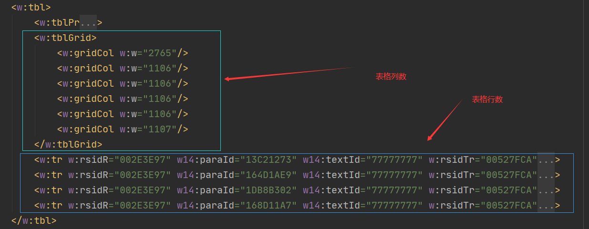
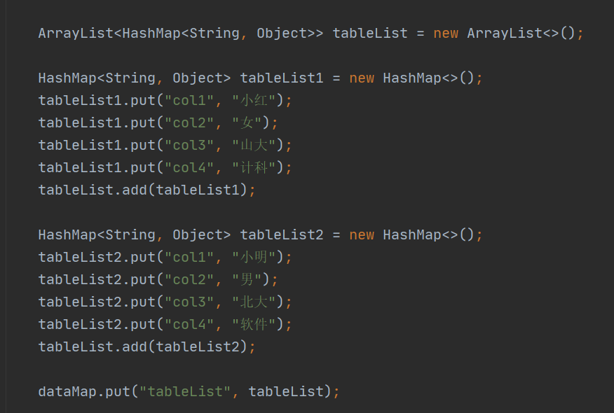

## Freemarker


>Freemarker是模板引擎。FreeMarker就是一种用Java编写的模板引擎， 即一种基于模板和要改变的数据， 并用来生成输出文本（HTML网页、电子邮件、配置文件、源代码等）的通用工具。 它不是面向最终用户的，而是一个Java类库，是一款程序员可以嵌入他们所开发产品的组件。


## 1. word xml

word的xml格式，另一种word的存储方式

### 1.2 table


doc格式和xml格式之间的映射


```shell
# word文档主体部分，也是我们编辑的部分
<w:body></w:body>
```





## 2. ftl

>ftl（FreeMarker Template Language）是Freemarker模板的文件后缀名。


## 3. 使用ftl生成word


### src/main/java

**FreemarkerGenerateWordFile**

```java
package freemarker.demo;

import freemarker.template.*;
import org.slf4j.Logger;
import org.slf4j.LoggerFactory;
import test.demo.ServiceDocumentData;

import java.io.*;
import java.util.ArrayList;
import java.util.HashMap;
import java.util.Locale;

/**
 * 使用freemarker框架，通过一个word模板和动态的参数，生成一个word新的word文档
 *
 */
public class FreemarkerGenerateWordFile {

    private static Logger logger = LoggerFactory.getLogger(FreemarkerGenerateWordFile.class);

    //文件转换编码
    private static String encoding = "UTF-8";


    /**
     * @param resourceLoaderClass 加载模板文件的加载类
     * @param basePackagePath     word模板文件所在的目录
     * @param wordTemplateName    word模板文件的文件名
     * @param outPathname         新生成word文件路径
     * @param templateParam       word模板所需要传入的参数
     */
    public static void generateWordFileByWordTemplate(Class resourceLoaderClass, String basePackagePath, String wordTemplateName, String outPathname, HashMap<String, Object> templateParam) {
        Template template = getTemplate(resourceLoaderClass, basePackagePath, wordTemplateName);
        File new_out_word = setNewOutputFile(outPathname);
        process(templateParam, template, new_out_word);
    }

    //用来测试
    public static void main(String[] args) {

        HashMap<String, Object> dataMap = getInputParams();
        generateWordFileByWordTemplate(FreemarkerGenerateWordFile.class, "/", "freemarker2word.ftl", "new_out_word.doc", dataMap);


    }

    /**
     * 文件转换过程
     *
     * @param dataMap
     * @param template
     * @param new_out_word
     */
    private static void process(HashMap<String, Object> dataMap, Template template, File new_out_word) {
        /**
         * 开始转换
         */

        /**
         * OutputStreamWriter
         * 使用指定的编码，把字符流转换成字节流
         */
        FileOutputStream out = null;
        try {
            out = new FileOutputStream(new_out_word);
        } catch (FileNotFoundException e) {
            e.printStackTrace();
        }
        OutputStreamWriter outputStreamWriter = null;
        try {
            outputStreamWriter = new OutputStreamWriter(out, encoding);
        } catch (UnsupportedEncodingException e) {
            e.printStackTrace();
        }

        //开始转换
        try {
            template.process(dataMap, outputStreamWriter);
        } catch (TemplateException e) {
            e.printStackTrace();
        } catch (IOException e) {
            e.printStackTrace();
        }

        try {
            outputStreamWriter.flush();
        } catch (IOException e) {
            e.printStackTrace();
        }
    }


    /**
     * 配置并获得模板文件
     *
     * @param resourceLoaderClass
     * @param basePackagePath
     * @param wordTemplateName
     * @return
     */
    private static Template getTemplate(Class resourceLoaderClass, String basePackagePath, String wordTemplateName) {
        /**
         * 配置freemarker
         */

        Configuration configuration = new Configuration();
        ClassLoader classLoader = FreemarkerGenerateWordFile.class.getClassLoader();
        System.out.println(classLoader);
        //System.exit(0);
        //路径是从“java/resources”下开始的，“/”就是开始路径
        configuration.setClassForTemplateLoading(resourceLoaderClass, basePackagePath);//设置模板文件所在的目录
        Locale locale = Locale.getDefault();
        System.out.println(locale.toString());
        if (configuration == null) {
            System.out.println("null");
            System.exit(0);
        }

        configuration.setEncoding(locale, encoding);
        configuration.setObjectWrapper(new DefaultObjectWrapper());
        configuration.setTemplateExceptionHandler(TemplateExceptionHandler.IGNORE_HANDLER);


        /**
         * 获取模板
         */
        Template template = null;
        try {


            //String name = "freemarker2word.ftl";//模板文件名字
            template = configuration.getTemplate(wordTemplateName, encoding);
        } catch (IOException e) {
            System.out.println("没有找到文件");
            e.printStackTrace();
        }
        return template;
    }

    /**
     * 设置新生成的word文件的输出路径
     *
     * @return
     */
    private static File setNewOutputFile(String pathname) {
        /**
         * 设置输出路径
         */
        File new_out_word = new File(pathname);

        //输出文件绝对路径
        String absolutePath = new_out_word.getAbsolutePath();
        System.out.println(absolutePath);

        if (new_out_word.isFile()) {
            if (new_out_word.exists()) {

                boolean delete = new_out_word.delete();
                logger.info("文件"+absolutePath+"已经存在，自动删除文件");
                logger.info("文件删除结果为："+ delete);

                /*logger.warn("生成文件已经存在了，请删除后再使用");
                System.out.println("文件 " + absolutePath + " 已经存在了");
                throw new RuntimeException("输出文件已经存在");*/
                //正常结束程序
                //System.exit(0);
            }
        }
        return new_out_word;
    }

    /**
     * 需要向word模板中传入的参数，参数是键值对的形式
     *
     * @return
     */
    private static HashMap<String, Object> getInputParams() {
        /**
         * 生成参数
         */
        HashMap<String, Object> dataMap = new HashMap<>();
        Object putResult = dataMap.put("tablename", "学生信息表");

        /**
         * 表格信息填入
         */

        //表格
        //ArrayList<HashMap<String, Object>> tableData = new ArrayList<>();
        //表格行
        //HashMap<String, Object> tableListData = new HashMap<>();


        ArrayList<HashMap<String, Object>> tableList = new ArrayList<>();

        HashMap<String, Object> tableList1 = new HashMap<>();
        tableList1.put("col1", "小红");
        tableList1.put("col2", "女");
        tableList1.put("col3", "山大");
        tableList1.put("col4", "计科");
        tableList.add(tableList1);

        HashMap<String, Object> tableList2 = new HashMap<>();
        tableList2.put("col1", "小明");
        tableList2.put("col2", "男");
        tableList2.put("col3", "北大");
        tableList2.put("col4", "软件");
        tableList.add(tableList2);

        dataMap.put("tableList", tableList);

        /*HashMap<String, Object> tableList3 = new HashMap<>();
        HashMap<String, Object> tableList4 = new HashMap<>();
        HashMap<String, Object> tableList5 = new HashMap<>();*/


        if (putResult == null) {

        } else
            System.out.println(putResult.toString());
        return dataMap;
    }
}

```

**DesignInputData**

```java
package freemarker.demo;

import java.util.ArrayList;
import java.util.HashMap;

/**
 * 用来设计word模板所需要的参数类型，参数类需要实现此接口
 * 每个word模板都需要一个单独的接口实现类来设计参数的
 */
public interface DesignInputData {
    /**
     * 需要向word模板中传入的参数，参数是键值对的形式
     *
     * @return
     */
    HashMap<String, Object> getInputParams();
}

```

使用

```java
package test.demo;

import freemarker.demo.DesignInputData;
import freemarker.demo.FreemarkerGenerateWordFile;

import java.util.HashMap;

public class Main {

    public static void main(String[] args) {


        ServiceDocumentData serviceDocumentData = new ServiceDocumentData();
        String serviceName = "xfgd";
        serviceDocumentData.setDataMap(serviceName);
        
        HashMap<String, Object> dataMap = serviceDocumentData.getInputParams();

        FreemarkerGenerateWordFile.generateWordFileByWordTemplate(
                FreemarkerGenerateWordFile.class,
                "/",
                "说明文档.ftl",
                serviceName+"接口文档.doc",
                dataMap);
    }
}

```

**ServiceDocumentData**

```java
package test.demo;

import freemarker.demo.DesignInputData;
import org.slf4j.Logger;
import org.slf4j.LoggerFactory;
import org.wwj.alone.mybatis.MybatisTest;
import org.wwj.mybatis.pojo.OperationInfo;
import org.wwj.mybatis.pojo.OperationParam;

import java.util.ArrayList;
import java.util.HashMap;
import java.util.List;

public class ServiceDocumentData implements DesignInputData {

    private static Logger logger = LoggerFactory.getLogger(ServiceDocumentData.class);


    private HashMap<String, Object> dataMap;

    /**
     * 初始化返回数据
     * @param serviceName
     */
    public void setDataMap(String serviceName) {

        logger.info("初始化服务 " + serviceName + " 的返回数据");
        this.dataMap = new HashMap<>();

        logger.info("填充服务标题");
        this.dataMap.put("serviceName", serviceName);


        logger.info("初始化服务的操作列表");
        ArrayList<HashMap<String, Object>> serviceOperationList;
        serviceOperationList = new ArrayList<>();

        logger.info("查询服务下的操作");
        List<String> operationList = MybatisTest.getOperationByService(serviceName);
        logger.info("服务 " + serviceName + " 拥有："+ operationList.size() + " 个操作");

        logger.info("开始填充服务的操作列表");
        for (int i = 0; i < operationList.size(); i++) {


            String operationName = operationList.get(i);
            logger.info("查询操作 " + operationName +" 的信息");
            OperationInfo operationInfo = MybatisTest.getOperationInfo(serviceName, operationName);
            logger.info("开始填充操作基本信息");
            HashMap<String, Object> operationTemp = new HashMap<>();
            operationTemp.put("serviceId", i + 1);
            operationTemp.put("serviceOperationName", operationInfo.getOperationName());
            operationTemp.put("requestPath", "http://ip:port/dwpspserver/dwpspservlet/uddi/serviceProxy");
            operationTemp.put("requestMethod", "POST/GET");
            operationTemp.put("encoding", "GBK");
            operationTemp.put("serviceOperationNameCN", operationInfo.getOperationNameCN());
            operationTemp.put("submitMethod", "Content-Type:application/x-www-form-urlencoded");
            operationTemp.put("authCode", "授权码");
            operationTemp.put("operationDesc", operationInfo.getOperationDesc());

            logger.info("开始填充操作输入参数");
            ArrayList<HashMap<String, Object>> inputParamList = new ArrayList<>();
            logger.info("开始查询输入参数");
            List<OperationParam> operationParamList = MybatisTest.getOperationInputParam(serviceName, operationName);

            int inputParamSize = operationParamList.size();
            logger.info("输入参数的个数为："+ inputParamSize);
            if (inputParamSize == 0){
                HashMap<String, Object> inputParam = new HashMap<>();
                inputParam.put("paraName", "没有参数信息");
                inputParam.put("paraDesc", "没有参数信息");
                inputParam.put("dataType", "没有参数信息");
                inputParam.put("dataLength", "没有参数信息");
                inputParam.put("desc", "没有参数信息");
                inputParamList.add(inputParam);
            }
            for (int i1 = 0; i1 < operationParamList.size(); i1++) {
                OperationParam operationParam = operationParamList.get(i1);
                HashMap<String, Object> inputParam = new HashMap<>();
                inputParam.put("paraName", operationParam.getParaName());
                inputParam.put("paraDesc", operationParam.getParaDesc());
                inputParam.put("dataType", operationParam.getDataType());
                inputParam.put("dataLength", operationParam.getDataLength());
                inputParam.put("desc", operationParam.getParamComment());
                inputParamList.add(inputParam);
            }
            operationTemp.put("inputParamList", inputParamList);
            operationTemp.put("axmlpara", "xml参数");

            logger.info("开始填充操作输出参数");
            ArrayList<HashMap<String, Object>> outParamList = new ArrayList<>();
            logger.info("开始查询输出参数");
            List<OperationParam> operationOutParamList = MybatisTest.getOperationOutParam(serviceName, operationName);
            int outParamSize = operationParamList.size();
            logger.info("输出参数的个数为："+ outParamSize);
            if (outParamSize == 0){
                HashMap<String, Object> outParam = new HashMap<>();
                outParam.put("paraName", "没有参数信息");
                outParam.put("paraDesc", "没有参数信息");
                outParam.put("dataType", "没有参数信息");
                outParam.put("dataLength", "没有参数信息");
                outParam.put("desc", "没有参数信息");
                outParamList.add(outParam);
            }
            for (int i1 = 0; i1 < operationOutParamList.size(); i1++) {
                OperationParam operationParam = operationOutParamList.get(i1);
                HashMap<String, Object> outParam = new HashMap<>();
                outParam.put("paraName", operationParam.getParaName());
                outParam.put("paraDesc", operationParam.getParaDesc());
                outParam.put("dataType", operationParam.getDataType());
                outParam.put("dataLength", operationParam.getDataLength());
                outParam.put("desc", operationParam.getParamComment());
                outParamList.add(outParam);
            }
            operationTemp.put("outParamList", outParamList);
            operationTemp.put("bxmlpara", "输出xml参数");


            logger.info("添加第："+ (i + 1) + " 操作到操作列表中");
            serviceOperationList.add(operationTemp);

        }


        this.dataMap.put("serviceOperationList", serviceOperationList);
    }

    public static void main(String[] args) {
        new ServiceDocumentData().setDataMap("xfgd");
    }

    @Override
    public HashMap<String, Object> getInputParams(){
        return this.dataMap;
    }
    /*@Override
    public HashMap<String, Object> getInputParams() {


        HashMap<String, Object> hashMap = new HashMap<>();
        //标题填充
        hashMap.put("serviceName", "接口一");

        //服务操作列表
        ArrayList<HashMap<String, Object>> serviceOperationList = generateOperationList();


        hashMap.put("serviceOperationList", serviceOperationList);

        return hashMap;
    }*/

    private ArrayList<HashMap<String, Object>> generateOperationList() {

        ArrayList<HashMap<String, Object>> serviceOperationList = new ArrayList<HashMap<String, Object>>();

        //生成单个操作，并加入list中
        HashMap<String, Object> serviceOperation = generateOperation();
        HashMap<String, Object> serviceOperation1 = generateOperation();


        serviceOperationList.add(serviceOperation);
        serviceOperationList.add(serviceOperation1);

        logger.info("当前服务拥有的操作个数为："+ serviceOperationList.size() + "个");
        
        return serviceOperationList;
    }

    private HashMap<String, Object> generateOperation() {
        //操作一，数据填充
        HashMap<String, Object> serviceOperation = new HashMap<>();

        serviceOperation.put("serviceId", 1);
        serviceOperation.put("serviceOperationName", "查询姓名");
        serviceOperation.put("requestPath", "查询姓名");
        serviceOperation.put("requestMethod", "请求方法");
        serviceOperation.put("encoding", "查询姓名");
        serviceOperation.put("submitMethod", "查询姓名");
        serviceOperation.put("authCode", "查询姓名");
        serviceOperation.put("operationDesc", "查询姓名");


        //生成入参list
        ArrayList<HashMap<String, Object>> inputParamList = generateInputParamList();
        //加入入参list
        serviceOperation.put("inputParamList", inputParamList);
        //入参xml
        serviceOperation.put("axmlpara", "入参xml报文");


        //生成出参list
        ArrayList<HashMap<String, Object>> outParamList = generateOutParamList();
        //加入出参list
        serviceOperation.put("outParamList", outParamList);
        //出参xml
        serviceOperation.put("bxmlpara", "出参xml报文");

        return serviceOperation;
    }

    private ArrayList<HashMap<String, Object>> generateOutParamList() {
        //出参list
        ArrayList<HashMap<String, Object>> outParamList = new ArrayList<>();

        //填充第一行
        HashMap<String, Object> outParam = new HashMap<>();
        outParam.put("paraName", "paraName");
        outParam.put("paraDesc", "paraDesc");
        outParam.put("dataType", "dataType");
        outParam.put("dataLength", "dataLength");
        outParam.put("desc", "desc");
        outParamList.add(outParam);

        HashMap<String, Object> outParam1 = new HashMap<>();
        outParam1.put("paraName", "paraName");
        outParam1.put("paraDesc", "paraDesc");
        outParam1.put("dataType", "dataType");
        outParam1.put("dataLength", "dataLength");
        outParam1.put("desc", "desc");
        outParamList.add(outParam1);
        //......填充更多行


        logger.info("输出参数为："+outParamList.size() + "行");

        return outParamList;
    }

    private ArrayList<HashMap<String, Object>> generateInputParamList() {
        //入参list
        ArrayList<HashMap<String, Object>> inputParamList = new ArrayList<>();

        //填充第一行
        HashMap<String, Object> inputParam = new HashMap<>();
        inputParam.put("paraName", "paraName");
        inputParam.put("paraDesc", "paraDesc");
        inputParam.put("dataType", "dataType");
        inputParam.put("dataLength", "dataLength");
        inputParam.put("desc", "desc");
        inputParamList.add(inputParam);
        //......填充更多行

        return inputParamList;
    }
}

```


**pom.xml**

```xml
<parent>
    <artifactId>spring-boot-starter-parent</artifactId>
    <groupId>org.springframework.boot</groupId>
    <version>2.2.6.RELEASE</version>
</parent>

<dependencies>
    <dependency>
        <groupId>org.springframework.boot</groupId>
        <artifactId>spring-boot-starter-freemarker</artifactId>
    </dependency>
</dependencies>
```


```java
package freemarker.demo;

import java.io.File;
import java.io.IOException;

public class Main {

    public static void main(String[] args) {

        /**
         * 新建一个文件，创建成功返回true
         */
        String pathname = "pathname_test.txt";
        //默认路径在当前项目根目录下，使用的是相对路径
        File file = new File(pathname);
        boolean newFile = false;
        try {
            newFile = file.createNewFile();
        } catch (IOException e) {
            System.out.println("创建失败");
            e.printStackTrace();
        }
        System.out.println(newFile);
    }
}

```


### 生成word


#### ${}占位符被分离

> 解决方法：把占位符在notepad中写好，复制到word中，否则直接在word中写会存在被分离的可能

**word文件内容**

> 使用一个特殊的标志，用来表示需要用变量代替的内容，此处使用了“替换”两字，可以自行定义


**注意word中的写法**


姓名后面的冒号之后必须再加个空格，可以是中文空格也可以是英文空格，否则$和{}会分开


**另存为，xml文件**；**或者直接保存为xml文件**

> 必须使用另存为，不能自己修改后缀名，**也可以保存文档时直接保存为 “Word XML 文档”** ，xml文档和doc文档都是可以直接编辑的


**直接修改xml后缀为ftl**


**当${}不能自动生成时，需要手动打开ftl文件，找到标志**


**替换成变量值**


其它行字段都修改为代码中map里对应的key值

对应赋值代码




```shell
<#if outList??>
对象不为空
</#if>
```


null判断

```shell
${outList.desc!"当前内容为空"}

判断outList.desc的值是否为空，如果为空，就使用!后的内容代替
```

获得list下标

```shell
<#list serviceOperationList as opList>
${opList_index}

# 获得opList的下标，在opList后面加一个_index，获得的下标是从0开始的

${opList_index+1}
# 通过运算修改下标值
```

for循环

```shell
<#list serviceOperationList as opList>
	
	<#--中间需要循环的部分-->

</#list>

# serviceOperationList是map中存储的List对象的key值
```

